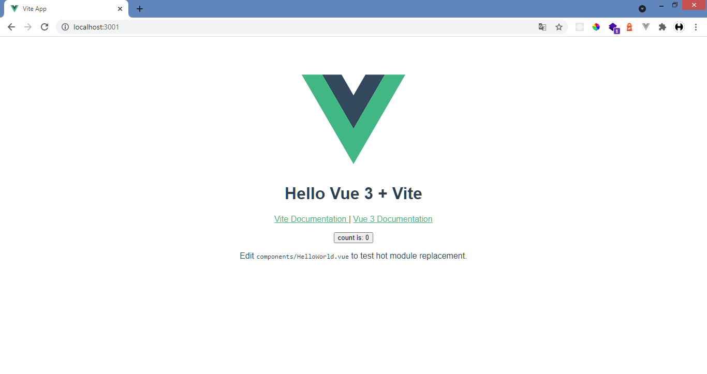

# Persiapan
Pertama-tama sebelum menginstall Vuejs dan tailwindcss kalian harus menginstall Nodejs dan npm terlabih dahulu.

Install nodejs cukup mudah, kalian hanya perlu download di sini:
[Download Node.js](https://nodejs.org/en/)

&nbsp;

Setelah menginstall nodejs kalian harus memastikan nodejs dan npm sudah terinstall.

Kalian hanya perlu ketikan baris kode ini di cmd/gitbash
```bash
node --version
```
```bash
npm --version
```

&nbsp;

# Install Vuejs

Pada tutorial kali ini kalian akan menginstall Vuejs menggunakan Vitejs.

Kenapa menggunakan Vitejs?

Dengan menggunakan Vitejs kalian dapat menjalankan server dengan sangat cepat hanya beberapa detik dan dependencies yang terinclude hanya sedikit jadi lebih hemat untuk penyimpanan.

Kalian juga bisa lihat penjelasannya lengkapnya disini:
[Why Vite?](https://vitejs.dev/guide/why.html)

&nbsp;

## Init Vitejs App

ketikan script ini pada cmd/gitbash dan pilih 
```bash
 npm init @vitejs/app first-vuejs-app
```

masuk ke directory <b>'first-vuejs-app'</b>
```bash
cd first-vuejs-app
```

untuk menginstall semua dependecies yang dibutuhkan
```bash
npm install
```

untuk menjalankan server vuejs yang akan jalan pada http://localhost:3000
```bash
npm run dev
```

&nbsp;
## First look Vuejs App



# Install Tailwindcss
Setelah menginstall Vuejs sekarang kalian akan menginstall tailwindcss, untuk menginstall tailwind kalian perlu beberapa package tambahan seperti postcss dan autoprefixer.

pastikan kalian sudah berada didalam directory project vuejs.

ketikan script ini di cmd/gitbash:
```bash
npm install -D tailwindcss@latest postcss@latest autoprefixer@latest
```

&nbsp;
## Membuat file konfigurasi

membuat file <b>'tailwind.config.js'</b> dan <b>'postcss.config.js'</b> secara otomatis dengan mengetikan:
```bash
npx tailwindcss init -p
```

ini akan membuatkan file <b>'tailwind.config.js'</b>
```javascript
module.exports = {
  purge: [],
  darkMode: false, // or 'media' or 'class'
  theme: {
    extend: {},
  },
  variants: {
    extend: {},
  },
  plugins: [],
}
```

dan membuatkan file <b>'postcss.config.js'</b> yang sudah memasukan plugin tailwindcss dan autoprefix.
```javascript
// postcss.config.js
module.exports = {
  plugins: {
    tailwindcss: {},
    autoprefixer: {},
  },
}
```

&nbsp;
## Hapus css yang tidak terpakai dengan purge

pada file <b>'tailwind.config.js'</b>, ubah option purge menjadi seperti ini.


```js {3-6}
// tailwind.config.js
  module.exports = {
    purge: [
      './index.html', 
      './src/**/*.{vue,js,ts,jsx,tsx}'
    ],
    darkMode: false, // or 'media' or 'class'
    theme: {
      extend: {},
    },
    variants: {
      extend: {},
    },
    plugins: [],
  } 
```

&nbsp;
## Masukan Tailwind pada css file

buat dulu file <b>'/src/tailwind.css'</b> dan masukan kode ini.
```css
/* ./src/tailwind.css */
@tailwind base;
@tailwind components;
@tailwind utilities;
```

pada file <b>'/src/main.js'</b> masukan file <b>'tailwind.css'</b> dengan import
```javascript
// src/main.js
import { createApp } from 'vue'
import App from './App.vue'
import './tailwind.css'

createApp(App).mount('#app')
```

&nbsp;

Ok, Sekarang tailwind sudah siap digunakan.

untuk memastikan mari kita coba masukan class tailwind dengan mengubah file <b>'/src/App.vue'</b>

```html
<!-- /src/App.vue --> 
<template>
  <div class="bg-blue-600 h-screen grid place-items-center">
    <h1 class="text-6xl font-bold text-white">First Vuejs + Tailwind App</h1>
  </div>
</template>

<script>
export default {

}
</script>

<style>
</style>
```

jika tampilkan kalian seperti ini, berarti tailwindcss sudah bisa digunakan. congrats!! :D


&nbsp;
# Kesimpulan
pada tutorial pertama ini kalian menginstall vuejs menggunakan vitejs dan menginstall tailwindcss beserta package pendukungnya seperti postcss dan autoprefixer.

kalian juga sudah mengkonfigurasi tailwindcss, dari mengkonfigurasi agar menghapus css yang tidak terpakai sampai tailwindcss siap untuk digunakan.
\
&nbsp;
>sampai nanti di tutorial selanjutnya di series:
> **Membuat Website Pertamamu Menggunakan Vuejs 3 + Vite dan Tailwindcss**
