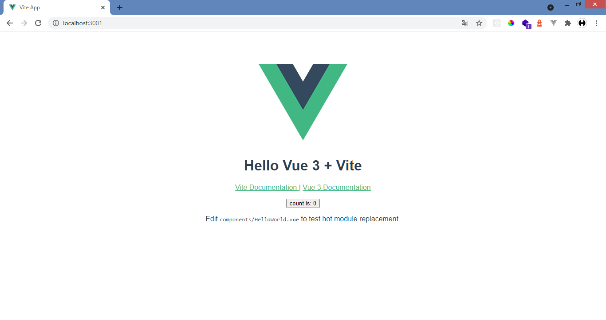

# Install Vuejs

Pada tutorial kali ini kita akan menginstall Vuejs menggunakan Vitejs.

Kenapa menggunakan Vitejs?

Dengan menggunakan Vitejs kita dapat menjalankan server dengan sangat cepat hanya beberapa detik dan dependencies yang terinclude hanya sedikit jadi lebih hemat untuk penyimpanan.

Kalian juga bisa lihat penjelasannya lengkapnya disini:
[Why Vite?](https://vitejs.dev/guide/why.html)

<br/>

## Init Vitejs App

ketikan script ini pada cmd/gitbash dan pilih **vue**
```bash
 npm init @vitejs/app first-vuejs-app
```

masuk ke directory **'first-vuejs-app'**
```bash
cd first-vuejs-app
```

install semua dependecies yang dibutuhkan
```bash
npm install
```

jalankan server vuejs yang akan jalan pada http://localhost:3000
```bash
npm run dev
```

<br/>

## First look Vuejs App



# Install Tailwindcss
Setelah menginstall Vuejs sekarang kita akan menginstall tailwindcss, untuk menginstall tailwind kita perlu beberapa package tambahan seperti postcss dan autoprefixer.

pastikan kita sudah berada didalam directory project vuejs.

ketikan script ini di cmd/gitbash:
```bash
npm install -D tailwindcss@latest postcss@latest autoprefixer@latest
```

## Membuat file konfigurasi

membuat file <b>'tailwind.config.js'</b> dan <b>'postcss.config.js'</b> secara otomatis dengan mengetikan:
```bash
npx tailwindcss init -p
```

file <b>'tailwind.config.js'</b>
```javascript:title=tailwind.config.js
module.exports = {
  purge: [],
  darkMode: false, // or 'media' or 'class'
  theme: {
    extend: {},
  },
  variants: {
    extend: {},
  },
  plugins: [],
}
```

file <b>'postcss.config.js'</b>
```javascript:title=postcss.config.js
module.exports = {
  plugins: {
    tailwindcss: {},
    autoprefixer: {},
  },
}
```

<br/>

## Hapus css yang tidak terpakai dengan purge

pada file <b>'tailwind.config.js'</b>, ubah option purge menjadi seperti ini.


```js:title=tailwind.config.js {3-6}
  module.exports = {
    purge: [
      './index.html', 
      './src/**/*.{vue,js,ts,jsx,tsx}'
    ],
    darkMode: false, // or 'media' or 'class'
    theme: {
      extend: {},
    },
    variants: {
      extend: {},
    },
    plugins: [],
  } 
```

<br/>

## Aktifkan JIT Mode

Apa itu jit mode pada tailwindcss ?

JIT Mode adalah feature dari tailwindcss 2, yang disebut sebagai The Next Generation of Tailwind CSS

JIT Mode punya beberapa kelebihan yang sangat keren, antara lain:
- Build CSS yang sangat cepat, hanya membutuhkan 800ms, dan saat mode watch hanya butuh 3ms untuk rebuild
- Semua variant terbuka tanpa harus configurasi terlebih dahulu
- Generate custom css langsung dengan tailwindcss. contoh: text-[#ff0000], h-[200px]
- dll.

Baca Selengkapnya di https://tailwindcss.com/docs/just-in-time-mode

pada file <b>'tailwind.config.js'</b>, tambahkan option mode dan isi dengan 'jit', seperti ini.

```js:title=tailwind.config.js {7}
  module.exports = {
    purge: [
      './index.html', 
      './src/**/*.{vue,js,ts,jsx,tsx}'
    ],
    mode: 'jit',
    darkMode: false, // or 'media' or 'class'
    theme: {
      extend: {},
    },
    variants: {
      extend: {},
    },
    plugins: [],
  } 
```

<br/>

## Masukan Tailwind pada file css

buat dulu file pada <b>'/src/tailwind.css'</b> dan masukan kode ini.
```css:title=src/tailwind.css
@tailwind base;
@tailwind components;
@tailwind utilities;
```

pada file <b>'/src/main.js'</b> masukan file <b>'tailwind.css'</b> dengan import
```javascript:title=src/main.js {4}
import { createApp } from 'vue'
import App from './App.vue'
import './tailwind.css'

createApp(App).mount('#app')
```

<br/>

## Mencoba Tailwindcss

Ok, Sekarang tailwindcss sudah siap digunakan.

mari kita coba masukan class tailwindcss dengan mengubah file **'/src/App.vue'**

```html:title=src/App.vue
<template>
  <div class="bg-blue-600 h-screen grid place-items-center">
    <h1 class="text-6xl font-bold text-white">First Vuejs + Tailwind App</h1>
  </div>
</template>

<script>
export default {

}
</script>

<style>
</style>
```

jika tampilkan kita seperti ini, berarti tailwindcss sudah bisa digunakan. congrats!! :D


<br/>

# Kesimpulan
pada tutorial pertama ini kita menginstall vuejs menggunakan vitejs dan menginstall tailwindcss beserta package pendukungnya seperti postcss dan autoprefixer.

kita juga sudah mengkonfigurasi tailwindcss, dari mengkonfigurasi agar menghapus css yang tidak terpakai sampai tailwindcss siap untuk digunakan.

<br/>

sampai nanti di tutorial selanjutnya di series:
 
**Membuat Website Pertamamu Menggunakan Vuejs dan Tailwindcss**
